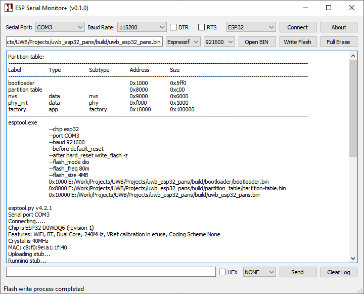

## ESP Serial Monitor+ 

**Version:** 0.2.0

Монитор последовательного порта и программатор для микроконтроллеров семейства ESP8266 и ESP32 с расширенными возможностями автоматизации



### Поддержка чипов:
- ESP8266
- ESP32

### Возможности программы
- Работает с прошивками, созданными в Arduino IDE, Sloeber, Espressif IDE
- Автоматически определяет местоположение всех фрагментов прошивки (загрузчик, таблица разделов, основное приложение и т.д.)
- Автоматически определяет режим программирования, частоту SPI-шины и объем памяти устройства (по данным из проекта)
- Автоматически определяет адреса записи каждого фрагмента прошивки в память устройства
- Читает таблицу разделов и выводит подробную информацию в окно логирования
- Мгновенное открытие последовательного порта после завершения процесса программирования, что позволяет сразу же увидеть отладочную печать устройства после сброса
- Возможность ручного сброса устройства с помощью линии *RTS*, а также перевод устройства в режим программирования манипуляцией сигналов *DTR* и *RTS*
- Отправка данных устройству в виде ASCII-текста или последовательности байт в режим HEX (полезно, если программа умеет обрабатывать команды, поступающие на пин RX отладочного UART-интерфейса)
- Возможность завершать передаваемые данные символом переноса строки (CR, LF, CR+LF), а также отправка спецсимволов CTRL+Z, ESC, что может быть полезно при работе с модемами
- Автоматическое сохранение настроек пользователя

### Требования
- **Операционная система:** Windows 7 SP1 или выше
- **Qt:** версия 5.7.1 или выше
- **Драйверы:** CH340/CH341, CP210x, FTDI (для USB-UART адаптеров)

### Сборка из исходников

Необходимые инструменты для сборки под Windows (MinGW):
1. Qt 5.7.1+
2. [Git for Windows](https://git-scm.com/downloads/win)
3. Компилятор MinGW (поставляется в комплекте с Qt)

> **Примечание:** Для успешного выполнения приведенного ниже набора команд добавьте в переменную **PATH** путь к компилятору MinGW (**C:\Qt\Qt5.7.1\Tools\mingw530_32\bin\\**), а так же путь к библиотекам и утилитам Qt (**C:\Qt\Qt5.7.1\5.7\mingw53_32\bin\\**)

> Для успешной сборки и работы приложения в ОС Windows 7 должны быть установлены обновления KB976932 и KB2533623

В командной строке Windows (cmd.exe) выполнить команды:
```batch
git clone https://github.com/unsi9ned/esp-serial-monitor
cd esp-serial-monitor
qmake ESPSerialMonitor.pro
mingw32-make
windeployqt release
xcopy utils release\utils /E /I /Y
release\ESPSerialMonitor.exe
```

### Быстрый старт

1. Подключить устройство ESP32 к компьютеру (например ESP_devkitc)
2. Установить необходимый драйвер порта (CH340/CH341, CP210x, FTDI)
3. В Диспетчере устройств определить номер COM-порта
4. Запустите **ESPSerialMonitor.exe**
5. В Arduino IDE выбрать плату ESP32 Dev Module и скомпилировать любой скетч
6. В ESP Serial Monitor+ задать номер Serial Port
7. Установить Baud Rate 115200
8. Выбрать чип ESP32
9. Открыть порт **Connect**
9. Выбрать IDE Arduino
10. Нажать **Open BIN** и указать путь к прошивке, которая находится в каталоге **%TEMP%\arduino_build_xxxxx\yyyyy.ino.bin**, где *xxxxx* - случайный номер, который среда сгенерирует для текущей сборки, *yyyyy* - название скетча
11. Записать программу **Write Flash**
12. При необходимости сбросить устройство **RTS**
